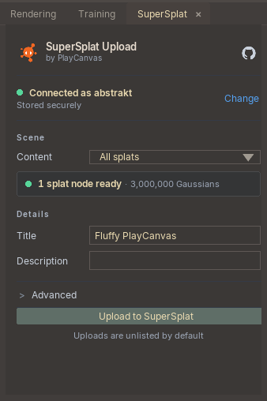

# SuperSplat for LichtFeld Studio

Upload Gaussian splat scenes from [LichtFeld Studio](https://lichtfeld.io/) directly to SuperSplat. The plugin uses LichtFeld's native exporter, stages a PLY or SOG file locally, and sends it to SuperSplat with progress reporting and resumable multipart uploads.

See the [LichtFeld Studio integration guide](https://developer.playcanvas.com/user-manual/supersplat/integrations/lichtfeld-studio/) for the canonical installation and usage instructions.

<p align="center">
  
</p>

## Features

- Upload all splat nodes in a scene or only the visible ones.
- Export as PLY or SOG with a chosen spherical harmonics (SH) degree.
- Follow export and upload progress without leaving LichtFeld Studio.
- Resume an interrupted upload from its locally staged export.
- Use up to eight parallel upload parts.
- Continue straight to the SuperSplat editor or viewer after an upload.
- New uploads are unlisted by default.

## Requirements

- LichtFeld Studio 0.5.3 or later.
- A SuperSplat API key.
- Python 3.10 or later, supplied by the LichtFeld Studio host.

The plugin has no required third-party Python dependencies. Secure persistent credential storage uses the host `keyring` package when available, with Windows DPAPI as a fallback on Windows.

## Installation

Copy this repository into LichtFeld Studio's plugin directory using the folder name `supersplat`:

| Platform | Destination |
| --- | --- |
| Windows | `%USERPROFILE%\.lichtfeld\plugins\supersplat` |
| Linux | `~/.lichtfeld/plugins/supersplat` |

Discover, enable, and load the plugin from LichtFeld Studio's Python Console:

```python
import lichtfeld as lf

lf.plugins.discover()
lf.plugins.settings("supersplat").set("load_on_startup", True)
lf.plugins.load("supersplat")
```

The **SuperSplat** tab should now appear in the main workspace.

## Uploading a scene

1. Open a scene containing at least one splat node.
2. Open the **SuperSplat** tab and connect with your API key.
3. Choose **All splats** or **Visible splats**.
4. Add a title and optional description.
5. If needed, open **Advanced** to choose the file format, SH degree, and number of parallel upload parts.
6. Select **Upload to SuperSplat**.

When the upload is accepted, the panel provides links to continue in SuperSplat or open the viewer. If an upload is interrupted after the local export completes, the plugin keeps the staged file and offers to resume or discard it.

## Credentials and local data

You can paste an API key into the panel or set `SUPERSPLAT_API_KEY` before launching LichtFeld Studio. The storage checkbox asks the plugin to remember the key between sessions:

- With secure storage enabled, the plugin attempts to use `keyring`, then Windows DPAPI on Windows.
- Without a secure credential backend, there is no plaintext fallback.
- API keys are never written to plugin settings or upload manifests.
- Signed storage requests never receive the SuperSplat API bearer credential.

Staged exports and one JSON checkpoint per upload are kept in a local cache so interrupted uploads can resume. Successful uploads remove both files.

| Platform | Default cache location |
| --- | --- |
| Windows | `%LOCALAPPDATA%\LichtFeld\SuperSplat` |
| Linux | `$XDG_CACHE_HOME/lichtfeld-supersplat`, or `~/.cache/lichtfeld-supersplat` |

The plugin also supports these environment and plugin settings:

| Setting | Purpose |
| --- | --- |
| `SUPERSPLAT_API_KEY` | Supplies the API key at launch. |
| `SUPERSPLAT_BASE_URL` | Overrides the default SuperSplat API base URL. |
| `SUPERSPLAT_CACHE_DIR` | Moves staged exports and upload checkpoints. |
| `base_url` plugin setting | Overrides the API base URL through LichtFeld's plugin settings. |

If both API URL overrides are configured, the `base_url` plugin setting takes precedence.

## Behavior and current limits

- Each upload is currently limited to 10 GiB.
- Selected-splat export is not yet available; use all or visible splats.
- Resume requires the original staged file at the same size and the same SuperSplat account.
- Transient part failures are retried with fresh signed URLs, and progress is checkpointed after each completed part.
- API redirects are rejected. The plugin reconciles local checkpoints with the server before resuming.

## Development

For development, link your checkout into LichtFeld's plugin directory instead of copying it after every change. The destination must not already exist.

Windows PowerShell, from the repository root:

```powershell
New-Item -ItemType Directory -Force -Path "$HOME\.lichtfeld\plugins" | Out-Null
New-Item -ItemType Junction `
  -Path "$HOME\.lichtfeld\plugins\supersplat" `
  -Target (Resolve-Path .)
```

Linux, from the repository root:

```bash
mkdir -p ~/.lichtfeld/plugins
ln -s "$(pwd)" ~/.lichtfeld/plugins/supersplat
```

Then enable the plugin and its watcher in LichtFeld's Python Console:

```python
import lichtfeld as lf

lf.plugins.discover()
lf.plugins.settings("supersplat").set("load_on_startup", True)
lf.plugins.load("supersplat")
lf.plugins.start_watcher()
```

With `hot_reload = true` in `pyproject.toml`, saves to Python files reload the active plugin. The current watcher does not watch `.rml` or `.rcss` files, so touch a Python file after changing the panel markup or styles:

```powershell
(Get-Item .\panels\main_panel.py).LastWriteTime = Get-Date
```

You can also reload explicitly:

```python
lf.plugins.reload("supersplat")
```

If reload fails, inspect `lf.plugins.get_error("supersplat")`. See the [LichtFeld plugin developer guide](https://lichtfeld.io/docs/guide/#hot-reload-debugging) for host-level debugging details.

## Tests

Run the isolated test suite from the repository root:

```console
python -m unittest discover -s tests -v
```

The tests use fake HTTP servers and never mutate the live SuperSplat service. Before release, run an authenticated upload and an interrupted/resumed upload inside LichtFeld Studio because the native `lichtfeld` module and exporter are provided by the host.
